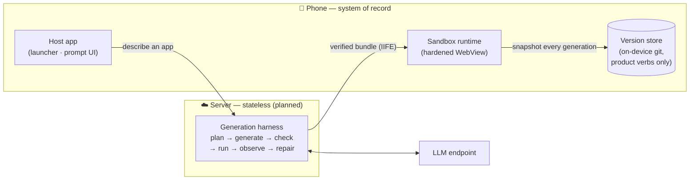
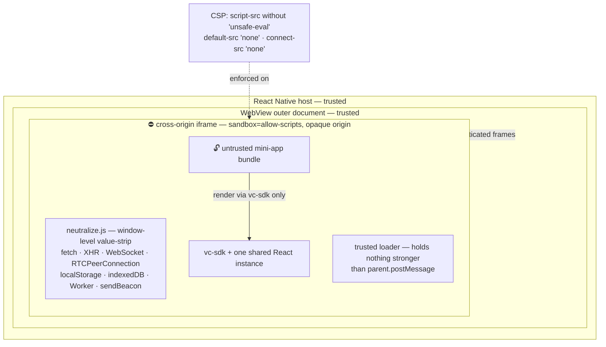
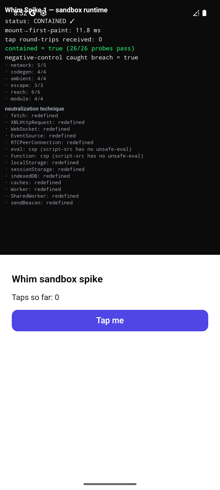
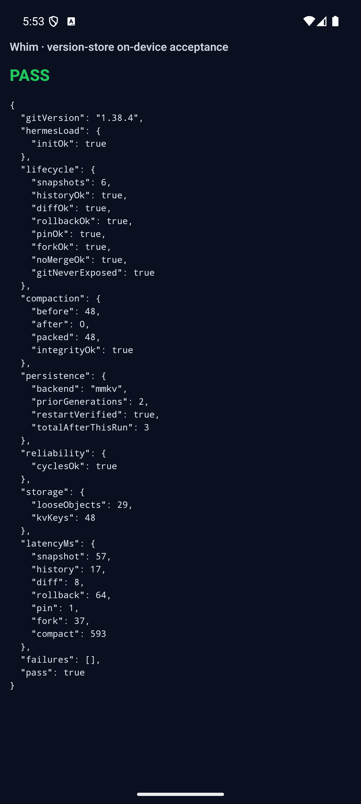
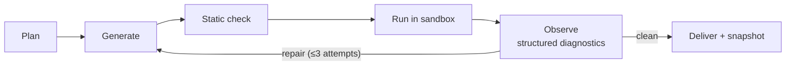

# Whim

**Vibe-code tiny personal apps on your phone, by talking. No code ever shown.**

[](https://github.com/Davron2004/Whim/actions/workflows/invariants.yml)


You describe what you want — *"a timer with my exact pour-over recipe"*, *"a tracker for some thing only I care about"* — an AI agent builds it against a small in-house SDK, and the result appears in your launcher as a runnable app. The thesis is the **long tail of personal software**: apps too small, too niche, or too personal to ever deserve a store listing. Whim collapses the effort to a sentence.

> 🎬 **Demo video — coming soon.** The sandbox runtime and version store are running on-device (screenshots below); an end-to-end recorded demo lands here once the next milestone is in.

---

## The interesting problems

This project exists to demonstrate harness engineering — the unglamorous machinery that makes LLM code generation *reliable* rather than impressive-once. The hard parts, in order of how much they fight back:

1. **Run untrusted, LLM-generated code on a phone, safely.** Every mini-app is code nobody reviewed. It runs in a sandbox that is pen-tested, never-regress-CI-gated, and assumes the bundle is actively hostile — including assuming it will *lie about its own containment*.
2. **Design an SDK for a model, not a human.** A small, fully-documented component surface that fits in a system prompt, accepts semantic tokens instead of raw values, and makes hallucinated imports structurally impossible.
3. **Version control nobody can see.** Every generation is snapshotted with full history, rollback, pinning, and forking — backed by real git, on-device, with zero git vocabulary reaching the user (a build guard fails if a hash or ref leaks into the API surface).
4. **A self-healing generation loop** *(next up)*: plan → generate → static-check → run → observe → repair, where the quality of the structured diagnostics fed back — not the model — is what makes the harness good.

## Architecture

The phone owns what's user-owned and must stay stable (apps, data, history, the runtime). The server owns what changes constantly (the harness, model access, checks, telemetry). The server is **stateless** — the device is the system of record.



A mini-app is **one TypeScript file** that imports only from `vc-sdk` and exports a `defineApp({...})` spec. esbuild turns it into a ~4.5 KiB IIFE; `react`, `react-dom`, and `vc-sdk` stay external and resolve to host-injected globals, so the resolvable module surface at runtime is exactly those three names — everything else throws.

### The sandbox

Containment rests on three legs, and the pen-testing showed **none is sufficient alone**:



- The **cross-origin iframe** (no `allow-same-origin`) denies all host/native reach — `parent.document`, `top.location`, the RN bridge are all `SecurityError`.
- The **CSP without `'unsafe-eval'`** is the only thing that closes the `({}).constructor.constructor('…')` codegen hole — every object reaches the `Function` constructor through its prototype chain, so no amount of global-stripping can. Conversely, `eval`/`Function` are *not* value-replaced: React's internals need them, and CSP kills codegen at the engine level anyway. Strip the capability, not the identifier.
- The **global value-strip** covers what CSP can't — notably `RTCPeerConnection`, since WebRTC ignores `connect-src`.

The adversarial suite assumes the worst finding from pen-testing (F4): a bundle **shares the iframe scope with the loader and can forge its own "I'm contained" verdict**. So the host never trusts a self-report — the verdict comes from closure-captured probes the bundle can't overwrite, and every iframe→host control frame is authenticated with a per-realm nonce. Realms are recreated per generation, because an earlier generation can otherwise backdoor the next one through `Object.prototype` (confirmed on-device, now a regression test).

All of this is enforced by a **never-regress invariant suite** (`npm run invariants`) that runs as a blocking CI gate — including a deliberately-broken-CSP negative control, so the suite proves it isn't vacuously green.

### The version store

Every generation is committed to a real git repository on the device (`isomorphic-git` under Hermes), one repo per mini-app. The public API speaks **product verbs only** — `snapshot · history · diff · rollback · pin · fork` — and a build-time guard fails if git vocabulary (a hash, a ref, a commit key) ever reaches a return shape. Since isomorphic-git has no `gc`, compaction is a DIY pack-then-drop-loose pass, triggered by loose-object *count* (the real pressure point on a KV-backed FS, not bytes).

## On-device evidence

Everything below was measured on the real target — Android System WebView / Hermes, RN new architecture, offline release build — not desktop Chrome.

| What | Result |
|---|---|
| Containment probes (trusted vantage) | **42/42 pass**, `contained:true` |
| Mini-app mount → first paint | **~119 ms** cold · **~32 ms** warm realm |
| Mini-app bundle size | **~4.5 KiB** IIFE |
| Snapshot / rollback / fork | ~45–86 ms · ~58–183 ms · ~37–68 ms |
| Storage cost per generation | ~650 B + ~4 git objects |
| Compaction | 48 loose objects → 0; history/rollback/fork still resolve |
| Persistence across app kills | 3× kill+relaunch cycles, **0 corruption** |

<p>
  
  
</p>

*Left: the containment verdict rendered on-device. Right: the version store verifying its own snapshots across three app restarts.*

## How this is being built

The process is as much the portfolio piece as the code:

- **Spike-driven de-risking.** Every risky unknown (can a WebView contain a hostile bundle? does isomorphic-git run under Hermes? what's the bundle delivery channel?) got a throwaway spike with explicit hypotheses and an on-device verdict. Spike scaffolds are deleted; findings outlive them in [`docs/`](docs/).
- **A numbered decision log.** [`docs/decisions.md`](docs/decisions.md) records 39+ decisions *with their rejected alternatives* — including the reversals, kept on the record.
- **Adversarial verification.** The bundle contract was pen-tested (T1–T8 + F4) before being productionized; the attacks that landed became carry-forward constraints, and the constraints became CI.
- **Spec-driven changes.** Work flows through [OpenSpec](openspec/) proposals → design → tasks → archive, with capability specs as the source of truth.
- **A raw devlog.** [`DEVLOG.md`](DEVLOG.md) captures the dead ends and "I was wrong about X" lessons before they evaporate.

## Status

| | |
|---|---|
| ✅ | **Sandbox runtime (v0.1)** — hardened WebView realm, bundle contract, nonce-authenticated verdicts, blocking-CI invariant suite |
| ✅ | **On-device version store (v0.2)** — snapshot/history/rollback/pin/fork over isomorphic-git + MMKV, accepted on-device |
| 🔜 | **Generation harness** — the server-side plan/generate/check/run/repair loop |
| 🔜 | **SDK design system** — the real component set + visual language (current SDK implements exactly what the first app uses) |
| ⏳ | Capability bridge (the "syscall table"), launcher UX, voice input, iOS |



## Repository map

```
build/        local stand-in for the future server build (esbuild pipeline)
src/runtime/  the WebView sandbox runtime (neutralize · resolver · probes · loader)
src/sdk/      vc-sdk — the private SDK mini-apps are written against
src/host/     RN shell, WebView host, on-device version store
invariants/   never-regress containment suites (blocking CI gate)
fixtures/     the sample mini-app + adversarial bundles that attack the sandbox
docs/         spec · numbered decision log · spike findings
openspec/     spec-driven change workflow (proposals → specs → archive)
```

## Running it

```sh
npm install
npm run build              # esbuild → runtime HTML + app bundles + artifacts
npm run invariants         # the containment suite vs this exact build (headless Chromium)
npm run vstore:test        # version-store acceptance suite (Node)
```

Desktop Chromium is the fast pre-check; the authoritative verdict is the real Android WebView. To run on a device/emulator (Node 22, JDK 21): `npm run android:release`.
