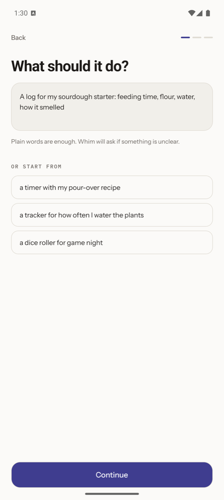
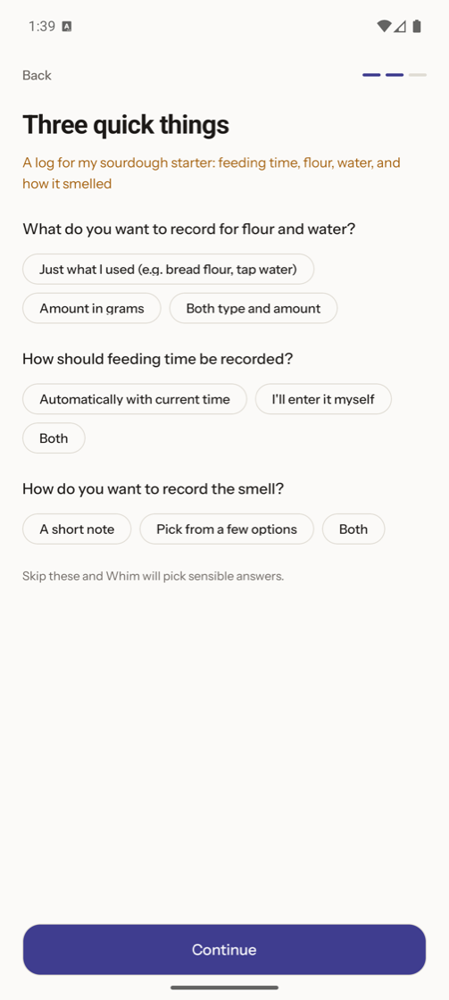
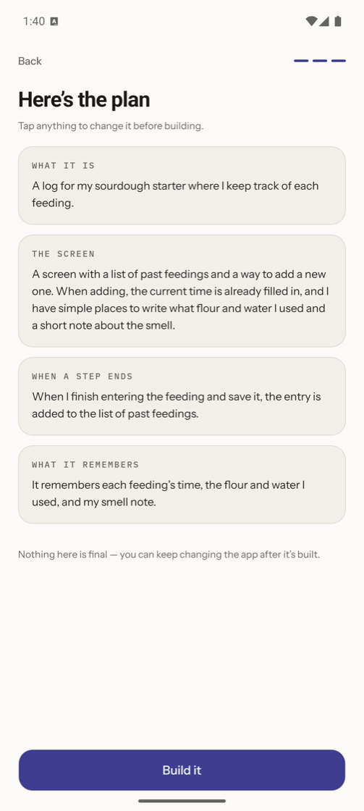
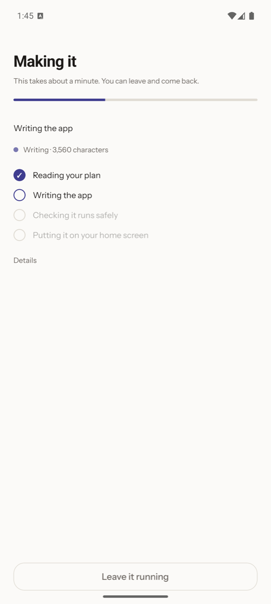
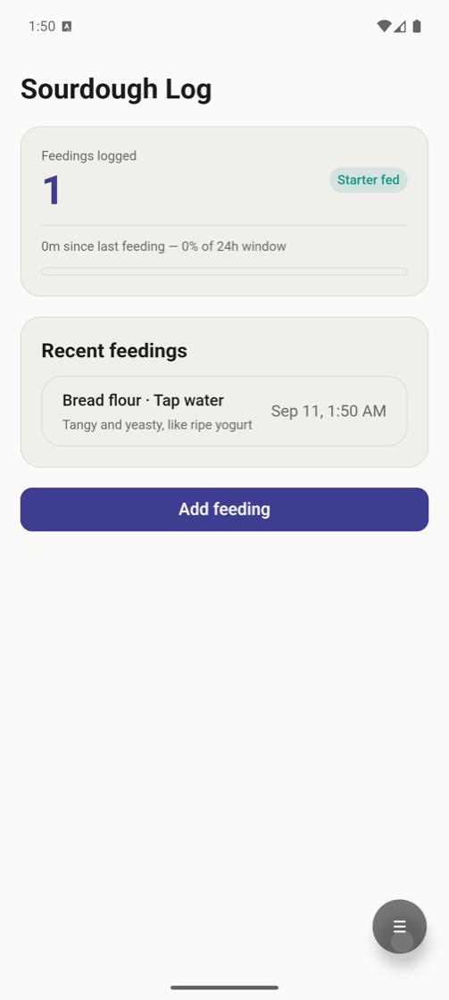
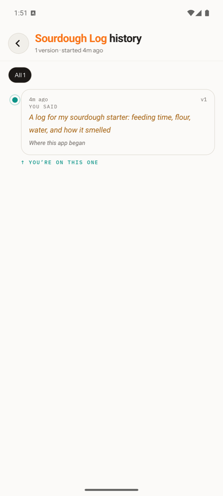
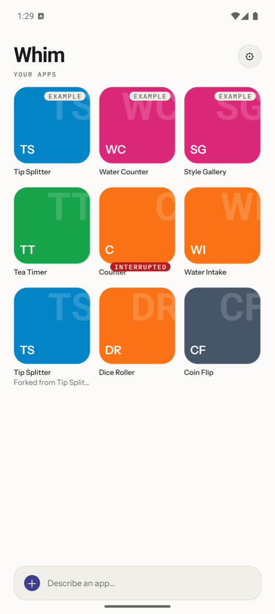
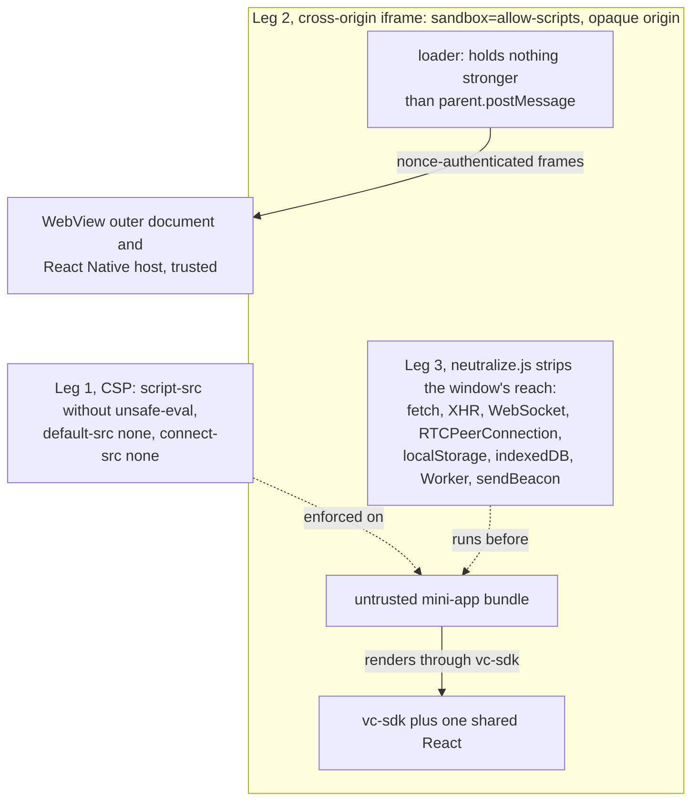
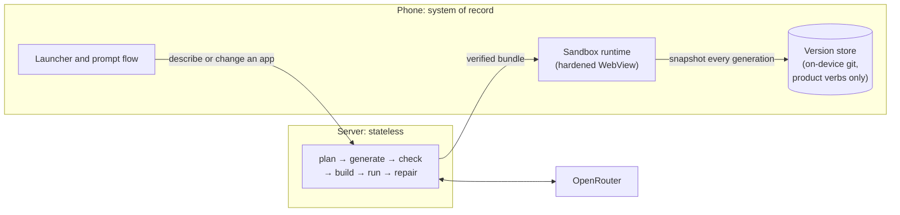

# Whim

**Describe a tiny app. It shows up on your phone, running. You never see code.**

[](https://github.com/Davron2004/Whim/actions/workflows/invariants.yml)
[](https://sonarcloud.io/summary/new_code?id=Davron2004_Whim)


Most software people want is too small to exist. A timer for one pour-over recipe. A log for a sourdough starter. A tracker for a thing only you care about. Nobody will build it, and no store will list it. Whim is a phone app where you type a sentence, answer a question or two, wait a few minutes, and the app is on your home screen. You can change it the same way, and every version is kept.

The generation is done by a model. The interesting part is everything around the model: running code nobody reviewed on a phone without letting it out, governing what it can touch, giving it an SDK it cannot misuse, and versioning every result so a bad generation is a rollback, not a loss.

<p align="center">
  
  
  
  
</p>
<p align="center">
  
  
  
</p>

*One real run on the emulator: the prompt was "A log for my sourdough starter: feeding time, flour, water, and how it smelled". Five minutes later the app on the right existed and had an entry in it.*

## What a session looks like

1. **Describe.** Type what you want. Whim asks a few quick questions with tappable answers, or you skip them and it picks. Then it shows the plan in plain words, and you can tap any line to change it before building.
2. **Build.** The server plans, generates one TypeScript file against the SDK, runs static checks over it, builds it, boots it in a headless copy of the same sandbox the phone uses, and pokes at every interactive element it can find. Anything that fails goes back to the model as a structured diagnostic, at most three times. The build screen shows what is happening: how many characters the model has written, how long it has been thinking, whether the connection is alive.
3. **Use.** The app lands on the home grid and opens full screen. It keeps its own data on the device. Opening it never talks to the server.
4. **Change it.** "Changing Sourdough Log" runs the same flow with the app's current source and data as context. If the app is at its latest version the edit replaces it; if you had rolled back first, the edit becomes a fork that shares the original's data.
5. **Go back.** Every generation is a snapshot. History shows them all, with restore, pin, and fork from any point.

## Why it is hard

**Untrusted code on a phone.** Every mini-app is code no human reviewed, so the sandbox assumes it is hostile, including assuming it will lie about being contained. Containment has three legs and pen-testing showed none is enough alone:


```mermaid
flowchart TB
    HOST["WebView outer document and<br/>React Native host, trusted"]
    CSP["Leg 1, CSP: script-src without unsafe-eval,<br/>default-src none, connect-src none"]
    subgraph IF["Leg 2, cross-origin iframe: sandbox=allow-scripts, opaque origin"]
        direction TB
        NEU["Leg 3, neutralize.js strips the window's reach:<br/>fetch, XHR, WebSocket, RTCPeerConnection,<br/>localStorage, indexedDB, Worker, sendBeacon"]
        APP["untrusted mini-app bundle"]
        SDK["vc-sdk plus one shared React"]
        LD["loader: holds nothing stronger<br/>than parent.postMessage"]
    end
    HOST ~~~ CSP
    CSP -. "enforced on" .-> APP
    NEU -. "runs before" .-> APP
    APP -- "renders through vc-sdk" --> SDK
    LD -- "nonce-authenticated frames" --> HOST
```

The iframe has an opaque origin, so `parent.document`, `top.location` and the native bridge are all a `SecurityError`. The CSP is the only thing that closes `({}).constructor.constructor('...')`, because every object reaches `Function` through its prototype chain and no amount of global stripping can stop that; `eval` and `Function` are left in place because React needs them and the CSP kills code generation at the engine level anyway. The global strip covers what CSP cannot, such as WebRTC, which ignores `connect-src`. A bundle shares scope with the loader and can forge its own "I am contained" report, so the host trusts only a verdict from closure-captured probes it cannot overwrite, delivered in frames authenticated by a per-load nonce. A new realm is created for every load, because an earlier generation can otherwise reach the next one through `Object.prototype`. That last one was found on a real device and is now a regression test.

**Governing what the code can touch.** Storage, haptics and sound are not ambient. They are syscalls over an append-only registry with a fixed-order gate. The channel needs no nonce: a forged reply posted by the bundle to its own window arrives with `ev.source` set to the iframe, never the parent, and the browser sets that field. An undeclared capability is refused with a structured error.

**An SDK for a model, not a person.** About 35 exports, documented in one file that fits in a system prompt. Components take semantic tokens, never raw colours or sizes, so a theme change restyles every app ever generated, including snapshots made before the theme existed. The shell ships one theme today; the picker was cut from the current design. The only resolvable imports at runtime are `vc-sdk`, `react` and `react-dom`; anything else throws, so a hallucinated import fails at build, not on the phone.

**Version control nobody sees.** Each app is a real git repository on the device (isomorphic-git under Hermes). The API speaks product verbs only: snapshot, history, diff, rollback, pin, fork. A build guard fails if a hash or a ref ever reaches a return type. isomorphic-git has no garbage collection, so compaction is a pack-then-drop pass triggered by loose-object count.

**A generation loop that repairs itself.** The state machine behind a request is plan, generate, check, build, run, repair, with every stage an injectable interface so the loop is tested against fakes. The run stage boots the candidate in the unmodified production sandbox page in headless Chromium and reports from a trusted vantage only. A bundle that fails containment is terminal, not repairable. The models are DeepSeek through OpenRouter with reasoning streamed back, so the build screen can show thinking as it happens.

## Architecture

The phone owns what must stay stable: apps, data, history, the runtime. The server owns what changes constantly: prompts, model access, checks. The server keeps no state; the device is the system of record.


```mermaid
flowchart LR
    subgraph Phone["Phone: system of record"]
        UI["Launcher and prompt flow"]
        RT["Sandbox runtime<br/>(hardened WebView)"]
        VS[("Version store<br/>(on-device git,<br/>product verbs only)")]
    end
    subgraph Server["Server: stateless"]
        H["plan → generate → check<br/>→ build → run → repair"]
    end
    M["OpenRouter"]
    UI -- "describe or change an app" --> H
    H <--> M
    H -- "verified bundle" --> RT
    RT -- "snapshot every generation" --> VS
```

A mini-app is one TypeScript file that imports only `vc-sdk` and exports a `defineApp` spec. esbuild turns it into a single IIFE of about 4.5 KiB; `react`, `react-dom` and `vc-sdk` stay external and resolve to host-injected globals.

## Measured on the device

Android System WebView on Hermes, release build, not desktop Chrome.

| | |
|---|---|
| Containment probes from a trusted vantage | 42 of 42, `contained: true`, with a broken-CSP negative control proving the suite is not vacuous |
| Mini-app mount to first paint | about 119 ms cold, 32 ms on a warm realm |
| Snapshot, rollback, fork | 45 to 86 ms, 58 to 183 ms, 37 to 68 ms |
| Storage per generation | about 650 bytes and 4 git objects |
| Persistence | 3 kill-and-relaunch cycles, no corruption |
| Syscall round trip | 16 to 17 ms median, bound by the two WebView-to-native crossings |
| A generation, end to end | about five minutes in the run pictured above, nearly all of it the model thinking |

## Status

Working on device: the sandbox runtime and its invariant suites, the version store, the per-app SQLite storage engine, the capability bridge, the launcher with its prompt, clarify, build, history and settings screens, the token-based SDK with a component kit and charts, the static check pipeline, the synthetic-run harness, the eval harness, and the generation loop with the edit flow.

Open: the formal end-to-end v1 acceptance on a fresh device over the network, voice input, iOS.

## How it is built

- Every risky unknown got a throwaway spike with a written hypothesis and an on-device verdict. The scaffolds are deleted; the findings live in [`docs/`](docs/).
- [`docs/decisions.md`](docs/decisions.md) is a numbered log of every decision with the alternatives it rejected, reversals included.
- The bundle contract was pen-tested before it was productionized. The attacks that landed became constraints, and the constraints became CI.
- Changes go through [OpenSpec](openspec/): proposal, design, tasks, archive. Capability specs are the source of truth, not the code.
- Most implementation is dispatched to subagents in isolated git worktrees, each gated by a pinned-commit integrity check and a red-then-green check that proves every new test can fail.
- [`DEVLOG.md`](DEVLOG.md) keeps the dead ends.

## Repository map

```
src/host/     RN shell: launcher, capability bridge, storage engine, version store
src/runtime/  the WebView sandbox runtime (neutralize, resolver, probes, loader, syscall)
src/sdk/      vc-sdk, the SDK mini-apps are written against
build/        esbuild pipeline: mini-app bundles and the runtime HTML the WebView loads
server/       @whim/server: Hono generation server (SSE, metering, the state machine)
contract/     @whim/contract: zod wire schemas shared by device and server
checks/       static check pipeline: AST checks over a closed diagnostic vocabulary
synthrun/     synthetic-run harness: headless-Chromium run-and-observe
evals/        corpus eval runner; the holdout set never enters the repo
invariants/   never-regress containment suites, the blocking CI gate
fixtures/     sample mini-apps and the adversarial bundles that attack the sandbox
docs/         decisions, spike findings, the prompt-ready SDK reference, handoffs
openspec/     spec-driven change workflow
```

## Running it

Node 22 and JDK 21.

```sh
npm install
npm run build              # runtime HTML, app bundles, artifacts
npm run invariants         # containment suite against this exact build (headless Chromium)
npm run launcher:test      # launcher acceptance (Node); vstore:test, storage:test, bridge:test, sdk:test, server:test likewise
npm run android:release    # offline release build onto a device or emulator
```

Generating needs the server: `npm run server:dev` with `OPENROUTER_API_KEY`, `WHIM_REWRITE_MODEL` and `WHIM_ENGINEER_MODEL` in `.env`, or `WHIM_PIPELINE=stub` for a canned pipeline. Opening apps you already have does not.
