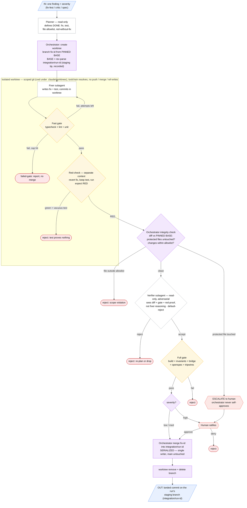
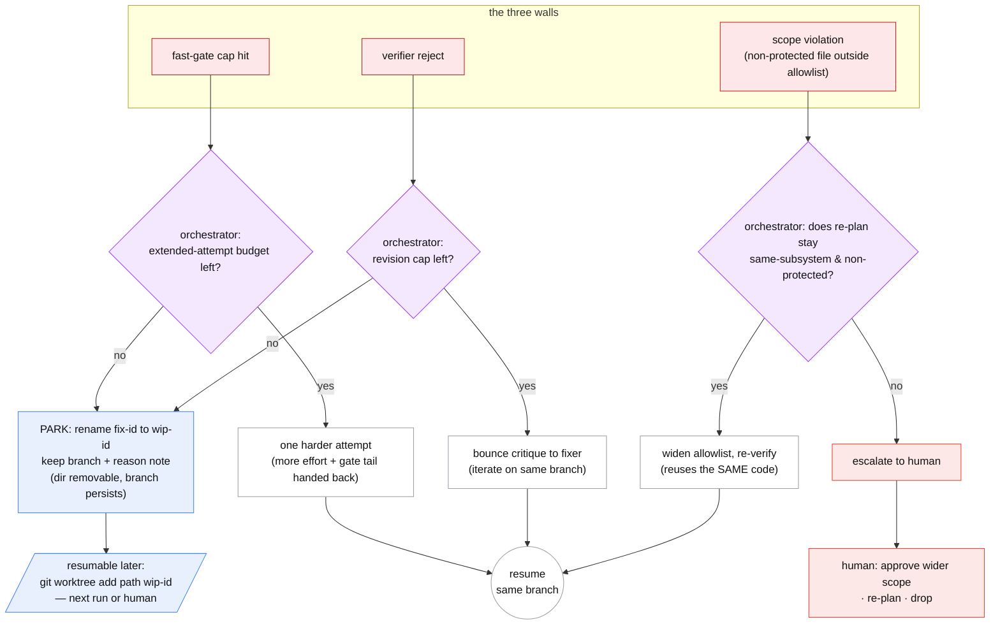

1. The per-finding pipeline

2. The parallel / fan-out view

```mermaid
flowchart LR
    BATCH[/"Batch of findings"/]:::io --> ORCH{{"Orchestrator — main thread<br/>plans + fans out"}}:::orch
 
    ORCH --> W1["worktree fix-1<br/>fixer · gates · red-check"]:::auto
    ORCH --> W2["worktree fix-2<br/>fixer · gates · red-check"]:::auto
    ORCH --> W3["worktree fix-N<br/>fixer · gates · red-check"]:::auto
 
    W1 --> Q{{"Orchestrator merge queue<br/>SERIALIZED — single writer<br/>integrity · verifier · full gate · approval"}}:::orch
    W2 --> Q
    W3 --> Q
 
    Q --> DV[/"integration/run-id (staging, landed)"/]:::io
    Q -.->|"escalate / reject"| HOLD(["human review / dropped"]):::human
 
    DV --> PUSH{{"Human (attended only):<br/>push integration/run-id<br/>+ draft PR → main"}}:::human
    PUSH --> SONAR["SonarCloud rounds on the draft PR<br/>nested /fix-loop on integration/run-id<br/>re-push until green"]:::auto
    SONAR --> CLEANUP{{"Human: /git-cleanup<br/>target=integration/run-id<br/>applies reset + force-with-lease push"}}:::human
    CLEANUP --> FMERGE{{"Human: ancestor check<br/>(main is ancestor of integration/run-id) passes,<br/>merge --no-ff into main, push"}}:::human
    FMERGE --> MAINOUT[/"OUT: main — one ratified merge,<br/>no post-merge regate"/]:::io

    classDef io fill:#e8f0fe,stroke:#4285f4,color:#111
    classDef auto fill:#ffffff,stroke:#9aa0a6,color:#111
    classDef orch fill:#f3e8fd,stroke:#a142f4,color:#111
    classDef human fill:#fce8e6,stroke:#ea4335,color:#111
```

Legend — who approves what (the colors)

┌───────────┬──────────────────────────────────────────────────┬──────────────────────────────────────────────────────────┐
│   Color   │                      Actor                       │                    Approval authority                    │
├───────────┼──────────────────────────────────────────────────┼──────────────────────────────────────────────────────────┤
│ 🔵 Blue   │ Inputs / outputs                                 │ —                                                        │
├───────────┼──────────────────────────────────────────────────┼──────────────────────────────────────────────────────────┤
│ ⚪ White  │ Subagent work (fixer, verifier)                  │ Bounded autonomy, no human                               │
├───────────┼──────────────────────────────────────────────────┼──────────────────────────────────────────────────────────┤
│ 🟡 Yellow │ Automated gate (fast gate, red-check, full gate) │ Exit code decides — no human                             │
├───────────┼──────────────────────────────────────────────────┼──────────────────────────────────────────────────────────┤
│ 🟣 Purple │ Orchestrator (main thread)                       │ Auto-approves only low/med merges; merges are serialized │
├───────────┼──────────────────────────────────────────────────┼──────────────────────────────────────────────────────────┤
│ 🔴 Red    │ You (human)                                      │ Ratifies highs + every protected-file touch; can deny    │
└───────────┴──────────────────────────────────────────────────┴──────────────────────────────────────────────────────────┘

The two structural invariants the picture encodes: (a) the pinned BASE is the only trust anchor — every integrity question is "diff vs BASE," never "diff vs HEAD"; (b) fan-out is parallel, but the merge queue is a single serialized writer to the run's staging branch (`integration/<run-id>`), so two fixes never race the same branch — `main` stays untouched until the attended closure phase lands the single ratified merge.

Failure modes (every red exit)

1. Fast gate fails + attempt cap hit → failed-gate, reported, nothing merges.
2. Red-check comes back green → vacuous-test reject (the crown-jewel check).
3. Integrity: a protected file changed → escalate to you (not auto-rejected — you decide).
4. Integrity: a file outside the declared allowlist changed → scope-violation reject.
5. Verifier rejects → re-plan or drop.
6. Full gate fails → reject.
7. You deny an escalation/high → reject.

