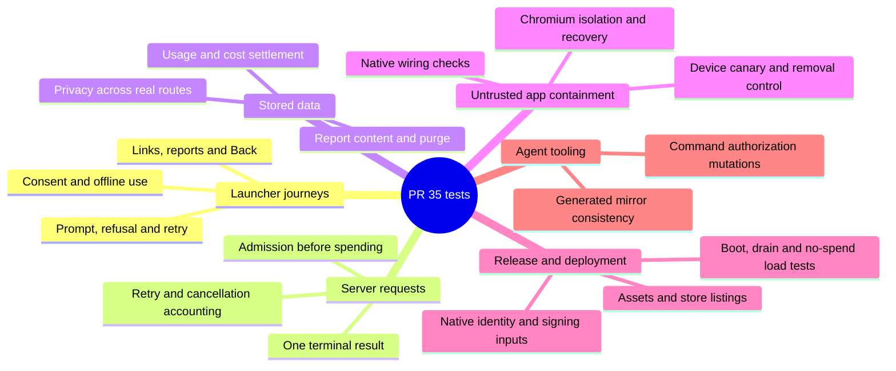

# Exploring PR #35's tests

> **Superseded for verdicts (2026-09-21):** the per-file Keep/Rewrite calls below were replaced by the
> repo-wide test audit in `openspec/critic/2026-09-21-test-audit/`. Use this file only as a reading
> guide.

Review baseline: `5e7b682ea5f54c62887d08ccbf7e57197c3c9f54`, compared with
`3a66cca3993aab0ce4680560fea326c349c55730`. Reviewed on September 19, 2026.

Start with the rendered launcher tests and the mounted server routes. They show
what a person can do and what a request actually changes. Follow into the smaller
helper tests when a boundary or failure case needs explaining.

This review covers 100 changed test/support/probe paths: 68 in the device and
release-check group, 26 server test/support files, and six operations/control-plane
files. These are not 100 independent suites. New test files were read for fixtures,
test bodies and assertions; existing files were reviewed around their changes.
The large deployment and browser orchestration helpers received narrower sampling.
Unchanged repository tests were not exhaustively audited.

## Mind map

## A useful reading order

| Order | Question to answer | Start here | Then follow |
| --- | --- | --- | --- |
| 1 | Can someone use Home, grant consent, edit a prompt and recover from refusal? | [launcher interactions](../src/host/launcher/test/launcher-interactions.suite.tsx), [screen controls](../src/host/launcher/test/screen-controls.suite.tsx) | [connectivity UX](../src/host/launcher/test/connectivity-ux.suite.tsx), [refusal landing](../src/host/launcher/test/refusal-landing.suite.ts), [app-link UI](../src/host/launcher/test/app-link-ui.suite.tsx) |
| 2 | Does the real server refuse, finish and cancel requests correctly? | [generate routes](../server/test/routes-generate.suite.ts), [unary routes](../server/test/routes-unary.suite.ts) | [admission](../server/test/admission.suite.ts), [real TCP disconnect](../server/test/disconnect.suite.ts), [generation machine](../server/test/machine.suite.ts) |
| 3 | Does retry/cancellation preserve the correct usage and cost? | `testRewriteLedgerEnding` in unary routes; `testTerminalSettlementRecovery` in generate routes | [resolver](../server/test/resolver.suite.ts), [SQLite ledger](../server/test/ledger.suite.ts) |
| 4 | Where can prompt, source and report text persist? | `testDataDirectoryHoldsOnlyTheTwoStores` in generate routes | [report store](../server/test/reports.suite.ts), [policy](../server/test/policy.suite.ts), [operator CLI](../server/test/admin.suite.ts), [logging](../src/host/logging/test/logging.suite.ts) |
| 5 | Can an untrusted mini-app escape, or leave expensive work running? | [synthetic-run isolation](../synthrun/test/isolation.ts), [resilience](../synthrun/test/resilience.ts) | [native wiring](../checks/test/release/native-network-deny.suite.ts), [canary self-test](../scripts/netdeny/test/canary.test.mjs), [device procedure](../openspec/changes/platform-release-readiness/handoff/netdeny-probe.md) |
| 6 | Will the built app and deployed server work with the intended configuration? | [release suite index](../checks/test/release/index.ts), [production build](../server/test/prod-build.suite.ts) | [deployment](../server/test/deploy-config.suite.ts), [load test](../server/test/loadtest.suite.ts), [real asset generation](../scripts/release/test-assets.mjs), [website and association files](../server/test/web-site.suite.ts) |
| 7 | What protects the development tools themselves? | [command policy tests](../.claude/hooks/test/bash-policy.test.sh) | [coding harness](harness.md), [mirror synchronization](../scripts/sync-codex.mjs) |

For each test, ask what deliberately broken behavior would make it fail. Then
check whether the setup reaches that behavior, whether the assertion observes it,
and whether another test already catches the same failure at the same boundary.
A component test and a small parser boundary matrix can both earn their place.

## Changes from this review

The test changes are integrated at `b431bae`. Independent diff review found no
blocking issues, and the combined checkout passed the full local gate. Eleven
test modules changed; production, build, gate and compiler configuration did not.

- Removed privacy checks that inspected an unrelated database or unused directory.
  The existing route test now requires a successful generation terminal and checks
  every submitted report field through both stored rows and marker bytes.
- Changed the zero-cost settlement test to inspect the persisted row. Removed
  duplicate credit ownership coverage, and changed the LRU sequence so FIFO fails.
- Removed a route imitation written inside an admission test. Real route cleanup
  and slot-handle stale/double-release cases remain.
- Removed the assumption that signing fingerprints must be absent in the checkout.
  Isolated unsigned, partially configured and signed fixtures remain.
- Removed the uncompiled type-test placeholder. Connectivity tests now render
  Home, Compose and LauncherRoot and invoke their controls. Refusal routing uses
  spec-owned expected groups, independent of the production table.
- Changed the canary self-test to select available ports, observe listener startup,
  capture diagnostics and terminate a stalled child after ten seconds. Releasing
  and rebinding an OS-selected port still has a small race; contention is reduced,
  not eliminated. All three verdict cases remain.

## Running the tests

Commands below use the primary checkout explicitly. `npm test` is the unused React
Native template command; it is not this project's acceptance suite.

| Scope | Command | What it establishes |
| --- | --- | --- |
| Launcher | `npm --prefix /Users/davrondjabborov/Work/other/Whim run launcher:test` | React interactions with in-memory native adapters, transport parsing and host state logic |
| Server | `npm --prefix /Users/davrondjabborov/Work/other/Whim run server:test` | Mounted requests, real SQLite and deterministic provider doubles |
| Static/release | `npm --prefix /Users/davrondjabborov/Work/other/Whim run checks:test` | AST checks and release configuration/asset/listing fixtures |
| Canary self-test | `node /Users/davrondjabborov/Work/other/Whim/scripts/netdeny/test/canary.test.mjs` | Whether the canary correctly accepts/rejects its observed evidence |
| Asset renderer | `cd /Users/davrondjabborov/Work/other/Whim && node /Users/davrondjabborov/Work/other/Whim/scripts/release/test-assets.mjs` | Actual Chromium rendering and decoded output pixels in temporary asset trees |
| Full local verification | `/Users/davrondjabborov/Work/other/Whim/scripts/gate-full.sh` | Build, Node suites, lint/types, release checks, Metro, Chromium, server integration and OpenSpec checks |

The canary self-test and real asset-renderer test are outside both gates at this
baseline. Run them explicitly. Adding a regular gate entry is a separate protected
configuration change; this test cleanup does not alter the gate or its exclusions.

## What to keep distinct

- Rendered launcher tests invoke React controls and effects. They do not establish
  native layout quality, UIKit behavior, System WebView containment or persistence
  across process death.
- Native project scans have purposeful mutations and protect wiring. The traffic
  verdict comes from a real device/simulator canary and its removal control.
- Android and iOS HTTP/TLS denial receipts already exist. They do not prove DNS
  denial. Physical signed-iPhone acceptance, cellular reconciliation and published
  association-file trust remain release obligations in the [readiness review](pr35-readiness-review.md).
- Privacy tests need text that actually passed through the system. Checking an
  untouched directory or database cannot prove that the system avoided storing it.
- The launcher assertion helper records failures and returns; the checks helper
  delegates to `node:assert.ok` and throws. Read the helper before judging try/catch
  assertions. The suspected swallowed launcher assertion was rejected for this reason.

## Remaining questions for your review

These are limits or follow-up candidates, not newly established product defects:

- `admin.suite.ts::testReadWhileWriting` uses two real SQLite connections, but its
  synchronous calls do not overlap. `ledger.suite.ts::testAtomicLastUnit` also does
  not prove cross-process transaction contention. A coordinated process test would
  be needed to establish those stronger claims.
- The existing chunked-body cap case checks the refusal status, without measuring
  how much input was consumed. It does not prove bounded reading by itself.
- The route-level privacy fixture uses stub policy. It does not independently prove
  that the real classifier cache never persists a digest.
- Source scans remain around boot/watchdog and some launcher wiring. Retain their
  coverage until a replacement exercises the actual hook or interaction; do not
  read their names as end-to-end evidence.
- Source/configuration mutations in release tests do not prove a signed archive,
  store upload or production deployment. The real asset-renderer test is useful
  additional evidence but currently requires an explicit command.

## Verification receipts

Both the baseline (`5e7b682`) and combined test changes (`b431bae`) passed the full
local gate with exit 0 and all 41 OpenSpec items valid. The final primary-checkout
run included 10,541 launcher checks and 2,667 server checks, plus the Chromium and
server integration suites. Counts record what ran; they are not a quality score.

The worktree gates hit the known shared-dependency production-bundle path assertion.
That unchanged assertion passed in the primary checkout. No checker was weakened
to make the worktree runs green.

| Additional check | Observed result |
| --- | --- |
| Skip empty-ID cost settlement | Old test passed; rewritten test failed on pending/null instead of resolved/0 |
| Drop submitted report source | Stored-row comparison and marker-byte check failed |
| Use FIFO instead of refreshing LRU access | Refreshed A survival and B eviction checks failed |
| Route payload_too_large back to sender | Independent expected landing failed |
| Hide Home's offline notice | Direct Home and LauncherRoot assertions failed |
| Disable Continue because the service is offline | Rendered control/interaction assertions failed |
| Run two canary self-tests concurrently | Both passed all three verdict cases |
| Stall canary startup | Independent control failed after ten seconds, killed the child and retained stderr |
| Generate release assets through Chromium | Passed pixel/output checks and missing/ambiguous-input rejection |

An independent reviewer checked all three implementation commits, retained
coverage, the mutation receipts and this guide's links/commands. The server controls
modified loaded source in memory; the device controls restored every temporary
source change byte-for-byte. The final diff contains only tests and these review
documents.

Local receipts are retained under
`/Users/davrondjabborov/.cache/whim-pr35-test-review-2026-09-19/`, including
`pr35-test-review-final-gate.log`, `pr35-test-changes-independent-review.md`, the
implementation reports and negative-control logs. The canary worker's original
occupied-port/startup observations were tool-output summaries; the independently
repeated startup-stall result has its own saved log. These are local evidence,
not committed artifacts or fresh physical-device acceptance.

## File inventory

The tables below record the assessment before editing. "Keep" means retain the
coverage in this batch; it is not a claim that every assertion is optimal.
"Rewrite/prune" applies only to the named subset. Native probes and runner/helper
files are included to make the execution paths easy to follow.

### Server and contract

| File | Disposition | Defect or behavior protected; evidence |
|---|---|---|
| [server/test/acceptance.ts](../server/test/acceptance.ts) | Keep | Registers new suites and calls report(); necessary execution wiring, no standalone assertions to prune. |
| [server/test/admin.suite.ts](../server/test/admin.suite.ts) | Keep, limitation | CLI list omits prompt/source; show returns full content; purge deletes stale rows; usage text/JSON includes costs and unresolved counts. `testReadWhileWriting` opens two real connections but its Promise.all does not overlap synchronous SQLite statements; see limitation below. |
| [server/test/admission.suite.ts](../server/test/admission.suite.ts) | Prune one local-route exercise; keep remainder | Slot isolation/caps, stale and duplicate release, drain refusal, refusal codes/Retry-After, verifier shape, credit TTL/invalidation/late lookup races and bounded fail-open transport. `runExitPaths` tests locally authored `holdGeneration`, while actual route suites cover these exits. |
| [server/test/config.suite.ts](../server/test/config.suite.ts) | Keep | Defaults, actual environment overrides, malformed/zero/negative limits, production refusal of dev modes/missing model config. Values come from the declared public launch contract. |
| [server/test/contract.suite.ts](../server/test/contract.suite.ts) | Keep | Report required/optional fields and 1000/1001, 200/201 boundaries; closed refusal vocabulary; runtime dependency and toolchain pins. These are wire/build constraints, so package inspection is appropriate here. |
| [server/test/deploy-config.suite.ts](../server/test/deploy-config.suite.ts) | Keep, sampled deep review | Parses Docker/Compose/Caddy configuration and plants concrete weakenings. Executes deploy/resize/provision/replay-recovery scripts in temporary Git trees with PATH stubs. Checks ordering and recovered state, not just script presence. Structural checks cannot prove deployed Caddy/Chromium behavior. Avoid deleting this suite by size. |
| [server/test/disconnect.suite.ts](../server/test/disconnect.suite.ts) | Keep | Real TCP socket destruction drives Hono cancellation; model abort, freed capacity, ledger cost and subsequent request are checked. Distinct from manually aborting Request.signal. |
| [server/test/e2e-drain-server.ts](../server/test/e2e-drain-server.ts) | Keep | Child fixture boots real lifecycle/synthetic-run composition and emits browser PID/context evidence for SIGTERM tests. |
| [server/test/e2e-fixtures.ts](../server/test/e2e-fixtures.ts) | Keep | Shared stuck-renderer candidate and scripted turns drive a real browser run held before first paint; no model spend. |
| [server/test/e2e.run.mjs](../server/test/e2e.run.mjs) | Keep | Browser suite bundling adds externals needed by production logging/toolchain. Execution plumbing. |
| [server/test/e2e.ts](../server/test/e2e.ts) | Keep | Boot self-test rejects a bad fixture; no listening before boot; TCP cancel closes real browser context; SIGTERM retains browser until deadline then disposes it; replay capacity/slot recovery and zero fetch count; active probe drain. Browser/process checks add coverage beyond machine doubles. |
| [server/test/ledger.suite.ts](../server/test/ledger.suite.ts) | Prune one marker block; keep remainder | Real SQLite daily/UTC boundaries, reopen durability, refund/settle/cost idempotence, legacy column migration and unresolved candidate ordering/age. Preserve exact column privacy guard. Marker never passed to store is not a leakage test. |
| [server/test/loadtest.suite.ts](../server/test/loadtest.suite.ts) | Keep | Refuses a real key before startup, traps fetch, forces replay transports, routes model roles, checks real build input exclusion with poisoned entry, SSE framing/capacity verdict math. Some deploy-file text checks overlap deploy-config, but they are small; do not use this to remove no-spend controls. |
| [server/test/machine.suite.ts](../server/test/machine.suite.ts) | Keep | Fenced source reaches check unwrapped; manual-clock boundary at deadline minus 1/deadline; abort vs timeout ordering; no late terminal after cancel; repair/run/summary teardown; HTTP and in-stream 402 mappings/caches. Similar-looking cases occur at different generator suspension points. |
| [server/test/openrouter.suite.ts](../server/test/openrouter.suite.ts) | Keep | HTTP and in-stream typed errors, retained ID on stream failure, rejected usage, and error-shaped generated text remaining ordinary content. Negative control prevents an overbroad error detector. |
| [server/test/policy.suite.ts](../server/test/policy.suite.ts) | Prune disconnected empty-dir test; keep remainder | Fail-closed classifier errors/malformed verdicts, input/source boundary, actual outgoing model settings, cache hit/TTL/eviction, content-free logs and stub behavior. `testNothingReachesDisk` inspects a directory never supplied to the system. |
| [server/test/prod-build.suite.ts](../server/test/prod-build.suite.ts) | Keep | Builds runtime tree outside checkout, checks runtime imports using AST, starts actual server process, breaks assets/permissions/browser path, SIGTERM/repeated-signal drain and real transport parsing. Runtime dependencies are symlinked to installed packages, so this is not a fresh container install proof. |
| [server/test/prompts.suite.ts](../server/test/prompts.suite.ts) | Keep | Missing policy section fails; actual generated authoring system messages carry document content; duplication scan enforces an explicit spec rule. Temporary missing-section directories lack cleanup, a small hygiene issue rather than a reason to remove coverage. |
| [server/test/reports.suite.ts](../server/test/reports.suite.ts) | Prune disconnected usage-db marker test; keep remainder | Real report serialization, retention and secure deletion; ordering/since/limit/UTF-8 sizing; scheduled purge. Marker leak test uses an unrelated usage DB. |
| [server/test/resolver.suite.ts](../server/test/resolver.suite.ts) | Rewrite empty-ID check; prune duplicate | Cost summing, credit ownership, partial/unresolved state, bounded hangs/fan-out, late sweep, drain stand-down and age starvation. Empty-ID report checked through generation-only aggregate is vacuous. Single-ID no-double-counting repeats stronger multi-ID case. |
| [server/test/routes-generate.suite.ts](../server/test/routes-generate.suite.ts) | Keep; strengthen existing privacy case | Mounted admission order/caps, policy refusal/refund, actual teardown on every ending, late-event suppression, recovery after SQLite settlement failure, accounting and connected data-directory proof. Preserve both transient/persistent settlement regressions. |
| [server/test/routes-unary.suite.ts](../server/test/routes-unary.suite.ts) | Keep | Mounted shared ceiling, store/model failure cleanup, retry cost/credit ownership, classifier credits across endings, report validation/privacy and separate probe capacity. Preserve three `withRequestDeadline` stalled requests and rewrite single/retry/failed-retry accounting cases. |
| [server/test/server-core.suite.ts](../server/test/server-core.suite.ts) | Keep | Health identity is asserted; completed usage vs client-disconnect race remains covered with new resolver seam. |
| [server/test/source-block.suite.ts](../server/test/source-block.suite.ts) | Keep | Small input-boundary matrix: tagged/bare/truncated fences, preamble, template literal preservation, no-fence identity. Machine integration case verifies usage in pipeline; this matrix protects parser edges. |
| [server/test/web-site.suite.ts](../server/test/web-site.suite.ts) | Prune temporary-state assertion; keep remainder | Consent/privacy parity with missing/new-disclosure controls, render escaping, absent/present association fixtures, exact copied bytes, failed/stale output handling. Hard-coded expectation that actual checkout has no signing fingerprints is temporary state, not a contract. |
| [server/test/wire-v2.suite.ts](../server/test/wire-v2.suite.ts) | Keep | Injected verifier rejects every mounted /v1 handler and admits another device; tests real middleware extensibility. |

### Device, release checks and native probes

| Changed path | Disposition | What it actually protects / qualification |
| --- | --- | --- |
| [checks/test/acceptance.ts](../checks/test/acceptance.ts) | Keep | Rejects file-path re-exports/import-equals, checks error severity/specifier, accepts vc-sdk control; registers release suites. |
| [checks/test/harness.ts](../checks/test/harness.ts) | Keep | Throwing node:assert helper with unchanged custom runner; recorded red/empty-test Sonar controls in readiness review. |
| [checks/test/release/android-project.suite.ts](../checks/test/release/android-project.suite.ts) | Keep | Real project plus isolated manifest mutants: exact launcher intent-filter, autoVerify, derived host, release cleartext denial and debug exceptions. Source/config only. |
| [checks/test/release/assets.suite.ts](../checks/test/release/assets.suite.ts) | Keep | Missing/stale assets, hash versus size/alpha separation, selected PNG source, native image references, independent PNG filter fixtures. Render output uses a fake here; Chromium asset tests belong to scripts reviewer. |
| [checks/test/release/domain-lockstep.suite.ts](../checks/test/release/domain-lockstep.suite.ts) | Keep | Native/launcher/deploy host agreement plus mismatch controls. The same-length-only test name overclaims its differently sized fixture; actual equality and both-value diagnostics are asserted. |
| [checks/test/release/hermes-entry.suite.ts](../checks/test/release/hermes-entry.suite.ts) | Keep | AST first side-effect import with moved/bound/comment controls; working UTF-8 polyfills, existing-global identity and platform mapping. Tiny missing-decoder case overlaps roundtrip but records original crash class. |
| [checks/test/release/index.ts](../checks/test/release/index.ts) | Keep helper | Sequential registration of all nine release suites; no independent behavior assertion. |
| [checks/test/release/ios-project.suite.ts](../checks/test/release/ios-project.suite.ts) | Keep | Real parsed project plus native identity, xcconfig, scene lifecycle, callback routing, privacy and entitlements mutants. UIKit invocation and signing are not exercised. |
| [checks/test/release/native-config.suite.ts](../checks/test/release/native-config.suite.ts) | Keep | Release identity, restricted xcconfig syntax, duplicate/missing keys, build-number arithmetic, tracked-literal scanner and planted-file controls. |
| [checks/test/release/native-network-deny.suite.ts](../checks/test/release/native-network-deny.suite.ts) | Keep | Comment/string-aware wiring scanner plus stock-manager, late-deny, false-deny, wrong-method, missing-rule/resource/fail-closed mutants. Real-wiring test names overclaim network behavior; native canary remains required. |
| [checks/test/release/release-cli.suite.ts](../checks/test/release/release-cli.suite.ts) | Keep | Pure preflight, AAB facts, privacy symbol/manifest matching, association-file contents and missing fingerprints, release-tag create/reuse/refuse. Does not invoke actual signing/store tools. |
| [checks/test/release/store-listing.suite.ts](../checks/test/release/store-listing.suite.ts) | Keep | Complete baseline with file-specific mutation findings: length versus UTF-8 bytes, privacy mismatch, screenshot aspect ratio and required listing files. Purposeful boundaries justify keeping the volume. |
| [src/host/BridgeProbeScreen.tsx](../src/host/BridgeProbeScreen.tsx) | Keep native probe | Native bridge verdict display; safe-area wrapper replaces fixed top padding. |
| [src/host/NetworkDenyProbeScreen.tsx](../src/host/NetworkDenyProbeScreen.tsx) | Keep native probe | Real platform WebViews driven against external traffic canary; row messages alone are not pass/fail containment evidence. |
| [src/host/StorageProbeScreen.tsx](../src/host/StorageProbeScreen.tsx) | Keep native probe | Native SQLite/storage verdict display; safe-area wrapper replaces fixed top padding. |
| [src/host/VersionStoreProbeScreen.tsx](../src/host/VersionStoreProbeScreen.tsx) | Keep native probe | Hermes/MMKV/version-store native acceptance display; safe-area wrapper replaces fixed top padding. |
| [src/host/launcher/DevProbeScreen.tsx](../src/host/launcher/DevProbeScreen.tsx) | Keep manual probe | Bundle buttons now deliver real source/record rather than an empty baked-name map. Manual render/containment workbench. |
| [src/host/launcher/dev-probe-fixtures.ts](../src/host/launcher/dev-probe-fixtures.ts) | Keep fixture helper | Maps the known manual fixture set to generated source/records; generated inputs remain build-owned. |
| [src/host/launcher/test/acceptance.ts](../src/host/launcher/test/acceptance.ts) | Keep runner | Registers/awaits new suites and reports accumulated launcher failures; nested screen suites are reached through their parent suites. |
| [src/host/launcher/test/ai-consent.suite.ts](../src/host/launcher/test/ai-consent.suite.ts) | Keep | Fresh/grant/revoke/version mismatch and malformed-record fail-closed behavior. Header mentions unreadable storage but no throwing-backend case is present. |
| [src/host/launcher/test/app-link-ui.suite.tsx](../src/host/launcher/test/app-link-ui.suite.tsx) | Keep | Real React Home/root/sheet interactions: selectable link, pending exclusion, warm/cold missing/failure routing, same-app instance retention, logging privacy, abort/late clarify response. |
| [src/host/launcher/test/app-link.suite.ts](../src/host/launcher/test/app-link.suite.ts) | Keep | Positive ID grammar plus hostile authority/query/fragment/port/encoded-slash cases; hostile global URL proves RN-independent parsing. |
| [src/host/launcher/test/back-policy.spec.md](../src/host/launcher/test/back-policy.spec.md) | Keep documentation | Updates overlay-first Back contract; not an executable test. |
| [src/host/launcher/test/back-policy.suite.ts](../src/host/launcher/test/back-policy.suite.ts) | Keep | Overlay intercept does not forward or consume ordinary depth-zero/depth-one Back behavior. Does not newly exercise every armed/unbound state. |
| [src/host/launcher/test/boot-state.suite.ts](../src/host/launcher/test/boot-state.suite.ts) | Keep | Manual clock executes startup expiry, trusted valid/invalid paint, zero timing, retry fencing and cleanup. Existing hook/surface wiring scans are structural and remain for now. |
| [src/host/launcher/test/build-lifecycle.suite.ts](../src/host/launcher/test/build-lifecycle.suite.ts) | Keep | Refused fresh attempts delete pending record/journal; retries and detached attempts retain honest failure and terminal journal. Concrete store assertions justify policy/helper overlap. |
| [src/host/launcher/test/bundle-error-watchdog.suite.ts](../src/host/launcher/test/bundle-error-watchdog.suite.ts) | Keep | Source wiring checks startup before injection and cancellation at hook lifecycle edges; timing semantics execute in boot-state suite. Candidate for later hook integration, not deletion without replacement. |
| [src/host/launcher/test/connectivity-ux.suite.ts](../src/host/launcher/test/connectivity-ux.suite.tsx) | Rewrite/prune subset | Keep truth tables; replace exact JSX/source regexes with visible offline Home/Compose interactions, prune duplicate unconfigured case. |
| [src/host/launcher/test/connectivity.suite.ts](../src/host/launcher/test/connectivity.suite.ts) | Keep | Manual timers verify capped retry schedule, stop/markOnline cancellation and no re-probe after success. Complements root integration rather than duplicating it. |
| [src/host/launcher/test/consent-flow.suite.ts](../src/host/launcher/test/consent-flow.suite.ts) | Keep | Consent decision/status matrix and safe decline target. Three named editing entry points supply identical continuation values; this is helper-shape coverage, not proof each UI entry is wired. |
| [src/host/launcher/test/consent-options.suite.ts](../src/host/launcher/test/consent-options.suite.ts) | Keep | Fresh KV grant/revoke visible immediately to live option lookup; no React timing or caller wiring is executed here. |
| [src/host/launcher/test/consent-screen-actions.suite.ts](../src/host/launcher/test/consent-screen-actions.suite.ts) | Keep | Exact safe/granting action rows for all modes. Generic row-count predicates overlap exact row arrays; rendered non-granting exits live in screen-controls. |
| [src/host/launcher/test/dev-probe-back-button.suite.ts](../src/host/launcher/test/dev-probe-back-button.suite.ts) | Keep | Added fixture map check verifies nonempty real app source and appId; existing Back source wiring remains. Empty fixture-list mutation would be vacuous, but no such change is proposed. |
| [src/host/launcher/test/error-reason.suite.ts](../src/host/launcher/test/error-reason.suite.ts) | Keep | Server hints versus scrubbed transport/shape messages, honest empty-bundle errors and unknown-error fallback. |
| [src/host/launcher/test/failure-screen.suite.ts](../src/host/launcher/test/failure-screen.suite.ts) | Keep | Changed system-Back source wiring is now partly covered by rendered screen-controls; retain broader non-destructive failure/Discard checks pending a dedicated conversion. |
| [src/host/launcher/test/fake-xhr.ts](../src/host/launcher/test/fake-xhr.ts) | Keep helper | Adds case-insensitive response headers for real XHR adapter tests. Native chunk decoding remains outside this fake. |
| [src/host/launcher/test/generation-client.suite.ts](../src/host/launcher/test/generation-client.suite.ts) | Keep | Fetch/unary refusal metadata and malformed Retry-After boundaries; report request/response, refusal/network/malformed body. h.ok(false) correctly records failures; no swallow bug. |
| [src/host/launcher/test/launcher-interactions.suite.tsx](../src/host/launcher/test/launcher-interactions.suite.tsx) | Keep | Real root effects with controlled fetch/timers verify stale result/refusal against changed server/consent, normalized same config and current success beating failed probe. |
| [src/host/launcher/test/link-routing.suite.ts](../src/host/launcher/test/link-routing.suite.ts) | Keep | Installed/pending/missing precedence, overlay/screen exit policy and one-shot latest pending link. Header incorrectly describes newer app-link-ui as source checks. |
| [src/host/launcher/test/native-host.tsx](../src/host/launcher/test/native-host.tsx) | Keep helper | In-memory native component/API adapters; Back/Link subscription ordering supports interactions. No layout or platform engine evidence. |
| [src/host/launcher/test/native-storage.ts](../src/host/launcher/test/native-storage.ts) | Keep helper | MMKV-shaped map preserves production backend adapter; native SQLite deliberately throws. No process-restart durability evidence. |
| [src/host/launcher/test/observability-ui.suite.ts](../src/host/launcher/test/observability-ui.suite.ts) | Keep | Added bare-DEV source scan and positive/negative pattern controls protect explicit diagnostics gating convention. Arbitrary function calls can satisfy its syntax, so it is not behavioral gate evidence. |
| [src/host/launcher/test/orb-menu.suite.ts](../src/host/launcher/test/orb-menu.suite.ts) | Keep | Report joins nondestructive actions, copy and colors; report callback wiring remains a source assertion, not a navigation integration. |
| [src/host/launcher/test/probe-gate.suite.ts](../src/host/launcher/test/probe-gate.suite.ts) | Prune one case | Keep runtime null/probe outcomes; remove unexecuted type-proof h.ok(true) case. |
| [src/host/launcher/test/prompt-flow-screens.suite.ts](../src/host/launcher/test/prompt-flow-screens.suite.ts) | Keep | Pure notice-clearing/edit/back state and existing source UI scans. New plan-Back helper case overlaps rendered interaction but is small and meaningful. |
| [src/host/launcher/test/prompt-flow-wiring.suite.ts](../src/host/launcher/test/prompt-flow-wiring.suite.ts) | Keep | Default/override/reset server KV behavior; consent/sender/cancellation/journal root source checks. Does not prove every actual data-sending UI entry solely by finding one guard. |
| [src/host/launcher/test/react-screen.ts](../src/host/launcher/test/react-screen.ts) | Keep helper | Async React act, exact visible button lookup, disabled-ancestor checks, deterministic timeout capture. press invokes callbacks but is not a real native gesture. |
| [src/host/launcher/test/refusal-landing.suite.ts](../src/host/launcher/test/refusal-landing.suite.ts) | Rewrite expectation groups | Request/step behavior and timer boundaries are useful; derive code groups independently from spec instead of production REFUSAL_RULES. |
| [src/host/launcher/test/refusal-target.suite.ts](../src/host/launcher/test/refusal-target.suite.ts) | Keep | Explicit server_busy/content_policy route cases preserve prompt/questions/answers and sender meaning; does not cover payload_too_large table mapping. |
| [src/host/launcher/test/release-config.suite.ts](../src/host/launcher/test/release-config.suite.ts) | Keep | Derived URLs, positive consent version, domain-literal scanner and scanner controls; current version pin is a deliberate release snapshot. |
| [src/host/launcher/test/report-payload.suite.ts](../src/host/launcher/test/report-payload.suite.ts) | Keep | Contract-valid bounds, switch/absent omission, exact preview keys, metadata-only logs, real memory version-store source/legacy retrieval. Byte-size input is ASCII, so Unicode length distinction is not established. |
| [src/host/launcher/test/report-send.suite.ts](../src/host/launcher/test/report-send.suite.ts) | Keep | Send enablement and phase recovery on success/refusal/error; status logging distinguishes device_id from network. ReportSheet integration itself is not rendered here. |
| [src/host/launcher/test/resolve-options.suite.ts](../src/host/launcher/test/resolve-options.suite.ts) | Keep | Non-null memo preference and live/null fallback; small helper truth table only, not same-turn consent continuation wiring. |
| [src/host/launcher/test/run.mjs](../src/host/launcher/test/run.mjs) | Keep runner | Bundles React screens with native adapters and external React packages; no typechecking of test source. |
| [src/host/launcher/test/scheme-host.suite.ts](../src/host/launcher/test/scheme-host.suite.ts) | Keep | Privacy-safe rejection log extraction strips query/userinfo/path/port and normalizes case; malformed input does not throw. |
| [src/host/launcher/test/screen-controls.suite.tsx](../src/host/launcher/test/screen-controls.suite.tsx) | Keep | Enabled visible exit/system Back callbacks, listener cleanup, consent review safe exits, row-edit cancellation, error fallback retry and orb Home through actual rendered controls. |
| [src/host/launcher/test/screen-exits.suite.ts](../src/host/launcher/test/screen-exits.suite.ts) | Keep | Latest handler/lifetime, rendered hook rerenders, safe-area policy, error boundary forwarding/reset; invokes screen-controls. Source adapter scan is an architectural convention check. |
| [src/host/launcher/test/server-probe.suite.ts](../src/host/launcher/test/server-probe.suite.ts) | Keep | Health identity classifications plus real abort signal on bounded hanging fetch and default fetch path. Hung guard leaves its short timeout pending; no correctness failure established. |
| [src/host/launcher/test/service-refusal.suite.ts](../src/host/launcher/test/service-refusal.suite.ts) | Keep | Closed code recognition, hint/error exclusions, retry time/copy boundaries and missing Intl behavior. Table key check alone does not pin per-code landing or tone. |
| [src/host/launcher/test/settings-probe.suite.ts](../src/host/launcher/test/settings-probe.suite.ts) | Keep | Debounce and stale/cancel result fencing with exact promises; delegates rendered screen verification. Cancel test exercises in-flight cancellation, not clearing an already scheduled timer; screen suite covers unmount timer cleanup. |
| [src/host/launcher/test/settings-screen.suite.tsx](../src/host/launcher/test/settings-screen.suite.tsx) | Keep | Rendered save-before-probe, classification/copy/color, clearing, absent-consent and unmount cancellation. Distinct from pure debounce behavior. |
| [src/host/launcher/test/settings-sections.suite.ts](../src/host/launcher/test/settings-sections.suite.ts) | Keep | Blank override starts Advanced closed and nonblank starts open; helper policy only. |
| [src/host/launcher/test/theme.suite.ts](../src/host/launcher/test/theme.suite.ts) | Keep | Added emoji text-presentation selector scanner with literal/comment controls. Preserves source convention but does not prove actual iOS font rendering. |
| [src/host/launcher/test/transport-shared.suite.ts](../src/host/launcher/test/transport-shared.suite.ts) | Keep | Runtime consent options and Retry-After grammar (scientific/hex/negative/date rejection, integer acceptance). Overlap with transports checks their adapters independently. |
| [src/host/launcher/test/xhr-transport.suite.ts](../src/host/launcher/test/xhr-transport.suite.ts) | Keep | XHR header adapter metadata, malformed body/header, explicit fetch/XHR equivalence. Existing incremental/abort/linear consumption tests retained; runtime platform decoder still requires device evidence. |
| [src/host/logging/test/logging.suite.ts](../src/host/logging/test/logging.suite.ts) | Keep | Specific note redaction at the actual ring-buffer seam prevents a key-list-derived test from missing removal of note; safe label remains visible. Boundary wiring check is structural. |
| [src/host/version-store/device-acceptance.ts](../src/host/version-store/device-acceptance.ts) | Keep native probe | Native acceptance entry updated to shared Hermes prerequisite module; actual probe assertions otherwise unchanged. |
| [src/runtime/web/probes.js](../src/runtime/web/probes.js) | Keep runtime probe | Tests prefixed WebRTC global, child-iframe reach and fresh-script aliases in sandbox; no source scan substitutes for observed network evidence. |

### Operations and command policy

| File | Gate/entry | Decision | Failure or invariant protected |
| --- | --- | --- | --- |
| [.claude/hooks/test/bash-policy.test.sh](../.claude/hooks/test/bash-policy.test.sh) | fast gate: `bash .claude/hooks/test/bash-policy.test.sh` | Keep | The exact root-only iOS simulator-install exception cannot become a protected-path write bypass; subagents, segment re-entry, wrappers, noncanonical paths, expansions, separators, redirects, and unrelated filesystem writes remain denied. |
| [scripts/netdeny/test/canary.test.mjs](../scripts/netdeny/test/canary.test.mjs) | manual: `node scripts/netdeny/test/canary.test.mjs` | Keep; rewrite process setup | A `--expect zero` result must fail if no bundle was fetched; a zero-traffic run with every bundle fetched must pass; `--expect leak` still requires all configured leak observations plus a TLS connection. |
| [scripts/release/test-assets.mjs](../scripts/release/test-assets.mjs) | manual: `node scripts/release/test-assets.mjs` | Keep; gate it | Real Playwright generation must produce a fresh, self-consistent asset tree from a PNG foreground, preserve actual Play icon pixels, record the source hash, and reject ambiguous or absent foreground input. |
| [synthrun/test/acceptance.ts](../synthrun/test/acceptance.ts) | full gate through `npm run synthrun:test` | Keep | The suite entry joins isolation and resilience tests to the existing real-runtime acceptance runner. |
| [synthrun/test/isolation.ts](../synthrun/test/isolation.ts) | same | Keep | Candidate builds may read only their entry/shim and approved externals; Chromium never launches with a sandbox-disabling option; each independent HTTP/WS/UDP denial layer works; a hostile candidate cannot reach canaries; service-worker registration cannot escape the isolated run. |
| [synthrun/test/resilience.ts](../synthrun/test/resilience.ts) | same | Keep | Aborted waiters do not consume slots, repeated release does not overgrant, queued/mount-aborted runs clean up once, browser crashes produce a named error and a fresh hardened browser, and a failed replacement does not poison later runs. |
